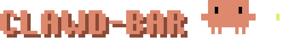

A Claude Code plugin that puts Clawd, Claude Code's pixel crab, in a three-row band above your
prompt. He acts out what your session is doing, gauges beside him show how much context and usage
you have left, and the lines after them show what's running and when Claude needs you. Start a CI
build and the band turns into a race against your best time.


<sub>Drawn by the plugin's own code: its scenes and its band.</sub>

## Install

```
claude plugin marketplace add KaiC5504/clawd-bar
claude plugin install clawd-bar@clawd-bar
```

Then start a new Claude Code session, or run `/reload-plugins` in the one you have open. Clawd
shows up above the prompt in the terminal and in the desktop app's Code tab.

**Requirements**

- A recent Claude Code. clawd-bar is built and tested on 2.1.289; if `/clawd` doesn't show up
  after installing, run `claude update` first.
- For CI races: the [GitHub CLI](https://cli.github.com), logged in with `gh auth login`.
- Tested on Windows 11. Desktop notifications use PowerShell on Windows, `osascript` on macOS
  and `notify-send` on Linux; the macOS and Linux ones haven't been tried on real machines yet,
  so reports are welcome.

**Update**

```
claude plugin marketplace update clawd-bar
claude plugin update clawd-bar@clawd-bar
```

then restart Claude Code. What changed in each version is in the [changelog](CHANGELOG.md).

**Uninstall**

```
claude plugin uninstall clawd-bar@clawd-bar
```

## What you see

**Gauges**, one per meter: how full your context is (`ctx`), then each usage limit (`5h`, `wk`)
with the time left until it resets. Green, yellow from 80 %, red from 90 %. They move only when
something happens: a new value fills in a box at a time, crossing 80 or 90 sweeps the new colour
across and flashes the percent, a limit that resets drains away and refills, and from 90 % the
last box beats like a heart.

**Three lines** after the gauges:

1. What he's doing right now (the file being edited, the command running, the search) and how
   long the turn has taken. Amber when he needs you, red when something broke.
2. The task list's progress, or this turn's tools and changed files. After a turn:
   `Done in 2m 14s · 23 tools · 5 files`.
3. The repo and branch.

In a narrow terminal the bars shrink first, then only the percents stay, so the lines keep their
room.

**And Clawd himself.** Every state is a little scene with its own props: a bulb that won't quite
switch on while he thinks, a scroll he unrolls to read, paper planes for subagents, a bell when
Claude needs you. While he works he plays a falling-block game. Every game ends on a perfect
clear, and between games he plays T-spin showpieces, so the loop runs for minutes without a seam.



## CI races

Start a build and the band becomes a race: the build's steps against your personal best, a ghost
of your fastest run, and Clawd hauling packages, stamping the signature, hammering out the build
and launching the release.



A race starts when:

- Claude runs `gh workflow run` to start a GitHub Actions workflow
- you type `/ci`, which picks up the latest run for this repo, live or just finished
- Claude runs `gh run watch <id>` in the foreground: clawd-bar takes that run over and watches
  it in the background instead, so Claude's turn isn't stuck waiting on it (only while **Let
  Claude continue after builds** is on, since Claude gets its new turn from that)

When the build finishes:

- a toast appears in Claude Code, and a desktop notification pops up
- your phone gets a push, if you've set an ntfy topic (see Settings)
- **Claude gets a new turn.** clawd-bar sends it the result as a prompt. After a pass, Claude
  picks up where it left off. After a failure, the prompt carries the failure log and asks
  Claude to diagnose and fix it. This only happens in a session open in the build's repo;
  anywhere else you just get the alerts. The log is marked as untrusted CI output, since anyone
  who can open a pull request writes some of it. Turn off **Let Claude continue after builds** to
  keep the race and the alerts without the new turn.

Codemagic builds race too: set `CODEMAGIC_API_TOKEN` (or put the token in
`~/.codemagic-token`) and use `/ci`.

## Commands

| Command | What it does |
| --- | --- |
| `/clawd` | Hide or show him. Remembered across sessions. |
| `/clawd demo` | Play every state on a loop, 6 s each. Run it again to stop. |
| `/clawd doctor` | Check the setup: what he's showing, the `gh` login, CI and bridge status. |
| `/clawd desk` | Switch [Clawd on Desk](#feed-clawd-on-desk) over to clawd-bar. |
| `/ci` | Watch the latest CI run for this repo. |
| `/ci stop` | Stop watching. |

## Settings

Open `/config` and find clawd-bar.

| Setting | Default | What it does |
| --- | --- | --- |
| Show Clawd above the prompt | on | Turn the whole status area on or off. |
| Watch CI builds | on | Race builds and send alerts when they finish. |
| Let Claude continue after builds | on | Send Claude the result as a new prompt when a build finishes. |
| ntfy topic | empty | An [ntfy.sh](https://ntfy.sh) topic name for phone pushes. Install the ntfy app, subscribe to the same topic, and you'll get a push when a build ends. Pick a long random name: anyone who knows it can read the pushes, which name your repo, branch and build. |
| Feed Clawd on Desk | on | Feed the Clawd on Desk app once `/clawd desk` has switched it over. Does nothing without the app. |
| Clawd on Desk app folder | empty | Found by itself. Set it only if `/clawd doctor` says the app wasn't found. |
| Node.js executable | `node` | Only used by the bridge. |

## Troubleshooting

- **Clawd isn't there.** Run `/clawd doctor`. If `/clawd` isn't a command at all, the plugin
  didn't load: run `/reload-plugins` or restart Claude Code, and `claude update` if that doesn't
  help.
- **`/clawd` shows the doctor instead of hiding him.** **Show Clawd above the prompt** is off in
  `/config`.
- **`/ci` doesn't exist.** Another plugin already has `/ci`. Builds Claude starts still race.
- **No race when Claude starts a build.** `/clawd doctor` shows whether `gh` is logged in and what
  the CI watcher sees.
- **Clawd on Desk doesn't react.** `/clawd doctor` says what's missing: the app's own hooks still
  installed (run `/clawd desk`), a restart still to do, or the app not found.
- **Clawd stutters in the desktop app's Code tab.** Known: the desktop restarts his animation
  whenever the band redraws. The terminal is the smooth one for now.

## Feed Clawd on Desk

If you also run the [Clawd on Desk](https://github.com/rullerzhou-afk/clawd-on-desk) desktop
pet, clawd-bar can send it this session's events in place of the app's `clawd-hook.js` command
hooks, which start a new `node` process for every event. clawd-bar runs one small sidecar
(`tools/clawd-bridge.js`) that loads the hook code from your installed app, so the desktop pet
gets exactly what the hooks would have sent.

1. In Clawd on Desk, open **Settings → Agents** and turn off **Manage Claude hooks
   automatically**. When it asks, choose **Disable automatic management only**. Otherwise the
   app puts its hooks straight back.
2. Run `/clawd desk`. It finds the app, backs up `~/.claude/settings.json`, removes the
   app's per-event hooks and keeps everything else, including the permission hook and
   auto-start (it adds them back if they're missing).
3. Restart Claude Code. `/clawd doctor` should show the sidecar running and events being
   forwarded.

Until step 2, clawd-bar sends nothing, so the desktop pet never hears an event twice. To go
back, turn **Manage Claude hooks automatically** on again in Clawd on Desk; it reinstalls its
own hooks, and clawd-bar steps aside at the next session.

## Develop

```
claude plugin validate .
claude plugin test .
```

It's a Claude Code plugin made of function hooks, so it runs inside Claude Code itself. Both
commands also run on GitHub Actions for every push and pull request.

- `hooks/scenes.ts`: every scene, drawn fresh each frame on a 30 × 6 pixel canvas
- `hooks/pixels.ts`: packs that canvas into terminal cells, four pixels to a cell in quadrant blocks
- `hooks/well.ts`: the falling-block game and its T-spin showpieces
- `hooks/pet-state.ts`: turns session events into what he acts out
- `hooks/band.tsx` and `hooks/bars.ts`: lay out the gauges and lines, and move the bars
- `hooks/svg.ts`: Clawd as an animated SVG, for the desktop app and this README
- `hooks/ci/`: watches the builds

He is the Claude Code logo, and his outline never changes: everything he does is carried by his
eyes, a flick of an arm, and the props beside him. Frames cut, never tween: at three terminal rows
a half-pixel move can only twitch, so he moves the way old game sprites do.

`node tools/preview/live.mjs` plays every scene in your terminal. The README's art is drawn by the
same code: after changing a scene or the band, run `npm ci && npm run build` in `tools/readme-art`
(needs Node 23.5+, and the Cascadia Mono and Segoe UI Symbol fonts that ship with Windows).

## Credits

[Clawd on Desk](https://github.com/rullerzhou-afk/clawd-on-desk) by
[@rullerzhou-afk](https://github.com/rullerzhou-afk) had the idea first: a Clawd who reacts to
what your coding agent is doing, as a desktop pet. clawd-bar takes that idea into the terminal,
and can feed Clawd on Desk if you run both.

## Disclaimer

Unofficial fan project. Clawd is Anthropic's character. This plugin is free, non-commercial, and
not affiliated with Anthropic or with
[Clawd on Desk](https://github.com/rullerzhou-afk/clawd-on-desk).

## License

MIT for the code. The Clawd character belongs to Anthropic and isn't covered by it.
